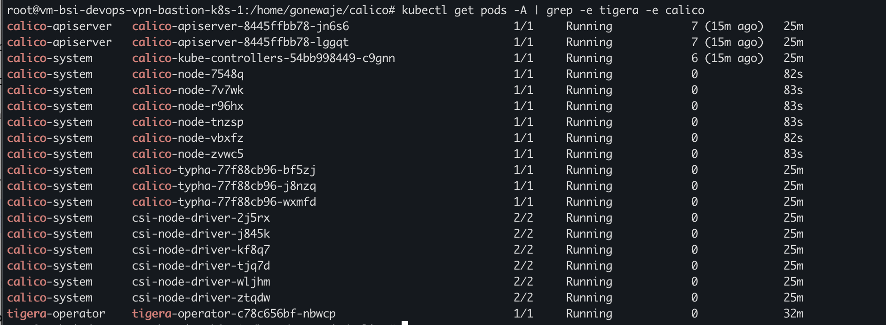

# INSTALLATION KUBERNETES MULTI MASTER FOR DEVOPS
install kubernetes multimaster Ubuntu 22.04 LTS
This steps run in GCP and using internal DNS of GCE

# ARSITEKTUR (TOPOLOGI)


## set the hostname and adjust it to the required hostname (do all node)
```bash
hostnamectl set-hostname {hostname}
```
| HOSTNAME    | IP            | KETERANGAN                                 |
| :--------   | :-------      | :----------------------------------------- |
| `lb-master` | `10.10.90.51` | Load balance for kube api-server port 6443 |
| `master-01` | `10.10.90.52` | Controle plane                             |
| `master-02` | `10.10.90.53` | Controle plane                             |
| `master-03` | `10.10.90.54` | Controle plane                             |
| `worker-01` | `10.10.90.55` | Worker                                     |
| `worker-02` | `10.10.90.56` | Worker                                     |
| `worker-03` | `10.10.90.57` | Worker                                     |


## set time (do all node)
```bash
timedatectl set-timezone Asia/Jakarta
```

## install and set up haproxy for kube api master

- Install HAproxy
```bash
apt update
apt-get install haproxy -y
```
- Configurasi for HAproxy

```bash
vim /etc/haproxy/haproxy.cfg
```
change and add your configuration like bellow

```bash
global
	log /dev/log	local0
	log /dev/log	local1 notice
	chroot /var/lib/haproxy
	stats socket /run/haproxy/admin.sock mode 660 level admin
	stats timeout 30s
	user haproxy
	group haproxy
	daemon

	# Default SSL material locations
	ca-base /etc/ssl/certs
	crt-base /etc/ssl/private

	# See: https://ssl-config.mozilla.org/#server=haproxy&server-version=2.0.3&config=intermediate
        ssl-default-bind-ciphers ECDHE-ECDSA-AES128-GCM-SHA256:ECDHE-RSA-AES128-GCM-SHA256:ECDHE-ECDSA-AES256-GCM-SHA384:ECDHE-RSA-AES256-GCM-SHA384:ECDHE-ECDSA-CHACHA20-POLY1305:ECDHE-RSA-CHACHA20-POLY1305:DHE-RSA-AES128-GCM-SHA256:DHE-RSA-AES256-GCM-SHA384
        ssl-default-bind-ciphersuites TLS_AES_128_GCM_SHA256:TLS_AES_256_GCM_SHA384:TLS_CHACHA20_POLY1305_SHA256
        ssl-default-bind-options ssl-min-ver TLSv1.2 no-tls-tickets

defaults
	log	global
	mode	http
	option	httplog
	option	dontlognull
        timeout connect 5000
        timeout client  50000
        timeout server  50000
	errorfile 400 /etc/haproxy/errors/400.http
	errorfile 403 /etc/haproxy/errors/403.http
	errorfile 408 /etc/haproxy/errors/408.http
	errorfile 500 /etc/haproxy/errors/500.http
	errorfile 502 /etc/haproxy/errors/502.http
	errorfile 503 /etc/haproxy/errors/503.http
	errorfile 504 /etc/haproxy/errors/504.http

listen stats
  bind    *:9000
  mode    http
  stats   enable
  stats   hide-version
  stats   uri       /stats
  stats   refresh   30s
  stats   realm     Haproxy\ Statistics
  stats   auth      Admin:Password

frontend kubernetes
        bind *:6443
        option tcplog
        mode tcp
        default_backend kubernetes-master-nodes

backend kubernetes-master-nodes
        mode tcp
        balance roundrobin
        option tcp-check
        server vm-gone-bsi-devops-master-k8s-1.asia-southeast2-a.c.poc-testinglab.internal 10.1.2.26:6443 check fall 3 rise 2
        server vm-gone-bsi-devops-master-k8s-2.asia-southeast2-b.c.poc-testinglab.internal 10.1.2.27:6443 check fall 3 rise 2
        server vm-gone-bsi-devops-master-k8s-3.asia-southeast2-c.c.poc-testinglab.internal 10.1.2.28:6443 check fall 3 rise 2

```
- makesure your configuration is valid check with command bellow

```bash
haproxy -f /etc/haproxy/haproxy.cfg -c
```
- if valid restart your haproxy service
```bash
systemctl restart haproxy 
systemctl status haproxy
```
- maksure your port 6443 is open, verification with command bellow
```bash
nc -vvvv lb-cluster 6443
```


# K8S INSTALLATION (DO ALL MASTER AND WORKER)

## update & upgrade repository
```bash
sudo apt-get update
sudo apt-get upgrade
```
## disable swap
```bash
sudo swapoff -a
sudo sed -i '/ swap / s/^\(.*\)$/#\1/g' /etc/fstab
```
## add kernel parameter
```bash
sudo tee /etc/modules-load.d/containerd.conf <<EOF
overlay
br_netfilter
EOF
```
## set layer file system and network bridge
```bash
sudo modprobe overlay
sudo modprobe br_netfilter
```

```bash
sudo tee /etc/sysctl.d/kubernetes.conf <<EOF
net.bridge.bridge-nf-call-ip6tables = 1
net.bridge.bridge-nf-call-iptables = 1
net.ipv4.ip_forward = 1
EOF
```
## reload the system
```bash
sudo sysctl --system
```

# INSTALLATION CONTAINERD (DO ALL MASTER AND WORKER)
## add denpedencies and install ca certificate
```bash
sudo apt install -y curl gnupg2 software-properties-common apt-transport-https ca-certificates
```
## add official repository
```bash
sudo curl -fsSL https://download.docker.com/linux/ubuntu/gpg | sudo gpg --dearmour -o /etc/apt/trusted.gpg.d/docker.gpg
sudo add-apt-repository "deb [arch=amd64] https://download.docker.com/linux/ubuntu $(lsb_release -cs) stable"
```
## install containerd
```bash
sudo apt update
sudo apt install -y containerd.io
```
## make directory config
```bash
containerd config default | sudo tee /etc/containerd/config.toml >/dev/null 2>&1
sudo sed -i 's/SystemdCgroup \= false/SystemdCgroup \= true/g' /etc/containerd/config.toml
```
## restart and enable service containerd
```bash
systemctl restart containerd
systemctl enable containerd
systemctl status containerd
```

# Install K8S Components
## add k8s signing key and repository
```bash
sudo apt-get update
# apt-transport-https may be a dummy package; if so, you can skip that package
sudo apt-get install -y apt-transport-https ca-certificates curl gpg

curl -fsSL https://pkgs.k8s.io/core:/stable:/v1.29/deb/Release.key | sudo gpg --dearmor -o /etc/apt/keyrings/kubernetes-apt-keyring.gpg

# This overwrites any existing configuration in /etc/apt/sources.list.d/kubernetes.list
echo 'deb [signed-by=/etc/apt/keyrings/kubernetes-apt-keyring.gpg] https://pkgs.k8s.io/core:/stable:/v1.29/deb/ /' | sudo tee /etc/apt/sources.list.d/kubernetes.list
```
## update the package list
```bash
apt update
```
## install kubectl kubeadm kubelet spceific version (v1.25)
```bash
sudo apt-get install -y kubelet kubeadm kubectl
```
## hold all service to keep version 
```bash
apt-mark hold kubelet kubeadm kubectl
```

# INITIAL MASTER NODE AND INSTALL CNI (CALICO)

## pull kubernetes image
```bash
kubeadm config images pull
```
## check preflight
```bash
kubeadm init phase preflight
```
## init Master (only do in one Master node recommend on master-01)
```bash
kubeadm init --control-plane-endpoint="10.1.2.24:6443" --upload-certs --pod-network-cidr=172.16.0.0/16
```
```bash
Result 

Your Kubernetes control-plane has initialized successfully!

To start using your cluster, you need to run the following as a regular user:

  mkdir -p $HOME/.kube
  sudo cp -i /etc/kubernetes/admin.conf $HOME/.kube/config
  sudo chown $(id -u):$(id -g) $HOME/.kube/config

Alternatively, if you are the root user, you can run:

  export KUBECONFIG=/etc/kubernetes/admin.conf

You should now deploy a pod network to the cluster.
Run "kubectl apply -f [podnetwork].yaml" with one of the options listed at:
  https://kubernetes.io/docs/concepts/cluster-administration/addons/

You can now join any number of the control-plane node running the following command on each as root:

  kubeadm join 10.1.2.24:6443 --token qm8e6s.fg21m2eijz2yuybi \
        --discovery-token-ca-cert-hash sha256:{{your_sha}} \
        --control-plane --certificate-key 60909e661e90bbb71004df24462d93dc869f3b493c119166e5e4921fc37e5356

Please note that the certificate-key gives access to cluster sensitive data, keep it secret!
As a safeguard, uploaded-certs will be deleted in two hours; If necessary, you can use
"kubeadm init phase upload-certs --upload-certs" to reload certs afterward.

Then you can join any number of worker nodes by running the following on each as root:

kubeadm join 10.1.2.24:6443 --token qm8e6s.fg21m2eijz2yuybi \
        --discovery-token-ca-cert-hash sha256:{{your_sha}}
```
## add kubeconfig admin 
```bash
mkdir -p $HOME/.kube
sudo cp -i /etc/kubernetes/admin.conf $HOME/.kube/config
sudo chown $(id -u):$(id -g) $HOME/.kube/config
```
check node by *kubectl get node*

## install calico
```bash
kubectl create -f https://raw.githubusercontent.com/projectcalico/calico/v3.28.1/manifests/tigera-operator.yaml
curl https://raw.githubusercontent.com/projectcalico/calico/v3.28.1/manifests/custom-resources.yaml -O
sed -i 's/cidr: 192\.168\.0\.0\/16/cidr: 172.16.0.0\/16/g' custom-resources.yaml
kubectl create -f custom-resources.yaml
```

## alternative way to install calico
```bash
kubectl apply -f https://docs.projectcalico.org/v3.23/manifests/calico.yaml
```

## notes
Make sure to open all ports between each instance/vm and sometimes need to delete all resources and reapply

## check calico pods and tigerastatus

```bash
kubectl get tigerastatus -o yaml
```

# INITIAL ANOTHER MASTER OR JOINING ANOTHER MASTER (do in master-02 and master-03)
## pull kubernetes image
```bash
kubeadm config images pull
```
## check preflight
```bash
kubeadm init phase preflight
```
## init Multimaster (do in master-02 and master-03)
```bash
kubeadm join lb-master:6443 --token qm8e6s.fg21m2eijz2yuybi \
        --discovery-token-ca-cert-hash sha256:{{your_sha}} \
        --control-plane --certificate-key {{your_certificate}}
```
## add kubeconfig admin 
```bash
mkdir -p $HOME/.kube
sudo cp -i /etc/kubernetes/admin.conf $HOME/.kube/config
sudo chown $(id -u):$(id -g) $HOME/.kube/config
```

# JOIN WORKER TO MASTER (DO IN ALL WORKER)
## join worker
```bash
kubeadm join lb-master:6443 --token qm8e6s.fg21m2eijz2yuybi \
        --discovery-token-ca-cert-hash sha256:{{your_sha}}
```

## tips
you can give a label for your nodes to make it easier to identify
```bash
kubectl label node vm-gone-bsi-devops-worker-k8s-1 node-role.kubernetes.io/worker=
kubectl label node vm-gone-bsi-devops-worker-k8s-2 node-role.kubernetes.io/worker=
kubectl label node vm-gone-bsi-devops-worker-k8s-3 node-role.kubernetes.io/worker=
```